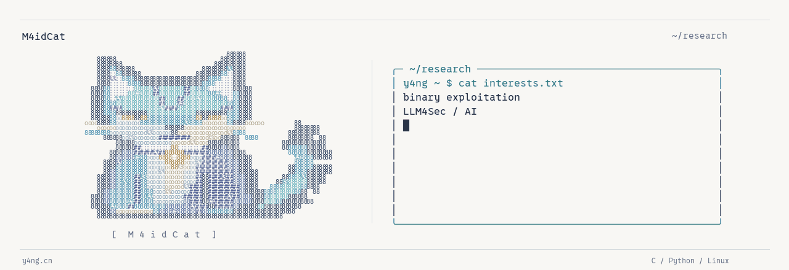

<a href="https://y4ng.cn/">
  <picture>
    <source media="(prefers-color-scheme: dark)" srcset="assets/banner-dark.gif">
    <source media="(prefers-color-scheme: light)" srcset="assets/banner-light.gif">
    
  </picture>
</a>

# Hi, I'm Y4ng 杨

A master's student at the **Institute of Software, Chinese Academy of Sciences**,
exploring **binary exploitation**, **LLM4Sec**, and **AI**.

[Homepage](https://y4ng.cn/) · [Blog](https://y4ng.cn/blog.html) · [ORCID](https://orcid.org/0009-0004-7936-1147)

### Research & CTF

- Software security at ISCAS; previously a research intern working on kernel security at Tsinghua University.
- Co-founder of [BITs2Sys](https://bitctf.cn/index.html) · Member of **NeSE**.
- I write about pwn challenges, reverse engineering, and what I learn along the way.

### From my notebook

| Note | Inside |
| :--- | :--- |
| [Protobuf pwn](https://y4ng.cn/post.html?slug=protobuf-pwn) | Reversing Protocol Buffers and exploring heap exploitation |
| [CISCN 2024](https://y4ng.cn/post.html?slug=ciscn-2024) | Pwn writeups: stacks, heaps, and debugging notes |
| [W&MCTF pwn writeups](https://y4ng.cn/post.html?slug=wm-ctf) | Memory leaks and working through offsets |

Also in the notebook: life, live music, and a David Tao concert. [生活杂记 ↗](https://y4ng.cn/post.html?slug=daily-2024)

---

Original maid-cat mascot · Terminal adapted from [ascii.rest](https://ascii.rest/#ui) by [bas3line](https://github.com/bas3line/ascii), under the [MIT license](LICENSE-ascii.rest.txt). [Still banner](assets/banner-light.png).

